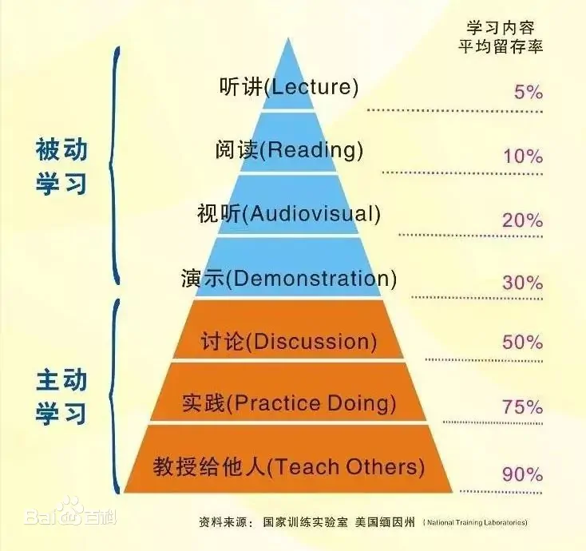
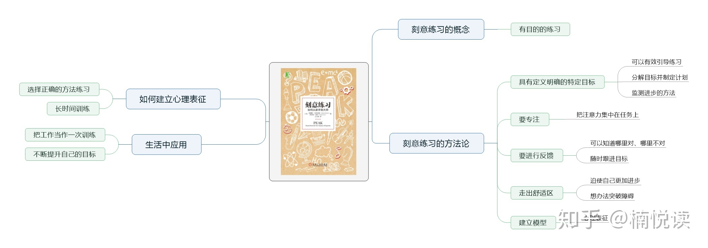

# Learning Skills

[10分钟速成课:学习技能](https://www.bilibili.com/video/BV1bW411a7oM?p=1&vd_source=e8e8ae7f3d32e535fdddcac9bd949d54)

## 一、做笔记

1. 笔记是自己对输入信息的再创造，应当有利于自己的理解；
2. 预习和总结亦是学习的关键步骤；
3. 笔记的形式并不重要，关键在于内容；
4. 做笔记方法：

> * 大纲法（条理清晰但格式单调不够形象）；
> * 康奈尔法（三分：笔记区、思考区、总结区）；
> * 思维导图（利于展现概念间的关系）；

## 二、阅读作业

1. 作业不必全部阅读；
2. 将阅读材料分为主要和补充两部分，主要的材料应该仔细阅读，有选择地阅读补充材料；
3. 阅读材料的优先级：论述->描述->背景；
4. 采取适当的阅读速度以保障理解力的高效，提升阅读速度的方法是增加阅读量；
5. 可以通过设置阅读时间来避免走神（番茄时钟）；
6. 在阅读材料上可以标注重点，但不能陷入标注误区；
7. 两种不同的记忆（recall it and recognize it，回忆和再认）在回忆到相关知识的时候，应当能从自己的记忆中独立地提取出来，而不是依赖线索地再认；
8. 摩斯密码法：标注论点和论据；
9. 主动阅读能够获取更多信息；
10. SQ3R：Survey、Question、Read、Recite and Review（浏览、提问、阅读、复述和复习）；

## 三、记忆

1. 感觉记忆->工作记忆（4~7块的容量，故对信息进行分块有助于记忆，记忆时间短）->长时记忆；
2. 间隔学习：稳定增强每次学习信息之间的间隔时间，有计划的主动回忆，艾宾浩斯遗忘曲线的核心在于重复；
3. 大脑具有过滤机制，会自动分辨信息的重要性，以采取不同的处理方式，遗忘是为了更好的学习；
4. 记忆的强度分为存储强度和提取强度，应该有目的地训练自己的提取强度。
5. 当信息理解困难的时候，延迟一段时间再去理解会更好。

## 四、计划与整理

1. 整理系统的方式：

| 任务管理器 | 日历 | 笔记 | 档案 |
|:----:|:----:|:----:|:----:|
|短期任务|长期作业|总结|归档|

2. 快速捕获灵感；
3. 做计划：日计划->周计划->长期计划；
4. 总结复盘很重要。

## 五、注意力与集中

1. 注意是把你的认知资源集中于特定的刺激或信息源，同时忽略环境中其他东西的过程；
2. 注意的种类：

> * 自上而下：有意注意（容易疲劳、可以锻炼）；
> * 自下而上：被动注意。

3. 锻炼有意注意的方法：停止同时进行多个任务，避免注意残留的干扰，改进工作环境划分学习区，番茄钟工作法（25~30分钟）；
4. 睡眠、营养和锻炼有助于大脑保持高效的运行。

## 六、拖延症

1. 短期激励有助于长期目标的实现；
2. 时间动机理论：动机=（期望*价值）/（冲动\*延迟）;
3. 提高期望的方法：

> * 分解任务；
> * 寻求帮助，合作学习，拒绝无效内卷。

4. 提高价值的方法：

> * 提高完成任务得到的奖励；
> * 提高做工作本身的体验；
> * 给完成子任务增加格外的奖励。

5. 低密度的娱乐和高密度的娱乐，与其被低密度的娱乐分心不如用高密度的娱乐放松自己以助于更好地投入学习；
6. 首先做最重要的事。

## 七、备考

1. 制定学习计划，劳逸结合；
2. 模拟测试；
3. 自问自答，费曼学习法；
4. 小抄练习：筛选出重要信息。

## 八、考试焦虑

1. 恐惧和焦虑不可避免，但要适度；
2. 三大恐惧：

> * 重复失败；
> * 面对未知；
> * 承担风险。

3. 弄清恐惧的对象；
4. 弄清失败的原因，并解决它们；
5. 学习未知为已知；
6. 如果一个人无法应对恐惧和焦虑，请寻求专业人士的帮助。

## 九、文章与写作

1. 在查阅资料前，进行前写作，从而更加有助于你查询资料；
2. 不要一气呵成地追求完美，由粗到细打磨；
3. 自由写作，严谨编辑；
4. 注重同行评审，取得客观回馈；

## 十、锻炼身体和学习

1. 运动与学习相辅相成，劳动创造智慧；
2. 野蛮体魄，文明精神；
3. 接纳有用的，拒绝无用的，加上特有的，谓之进步。

---

## 杂记

1. 学习金字塔模型

2. 刻意练习

